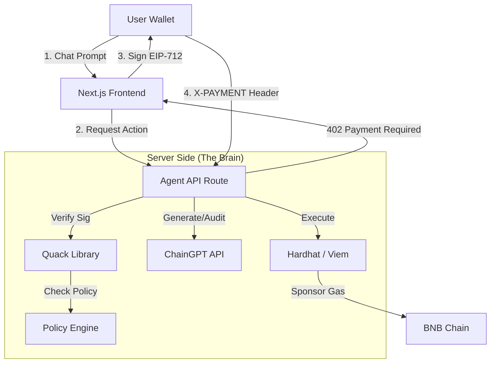

***

# 🦆 Vibe Quack Agent

### **The Super Web3 Copilot on BNB Chain**
**Winner of the Quack x ChainGPT Super Web3 Agent Bounty.**

[](https://testnet.bscscan.com/)
[](https://chaingpt.org/)
[](https://quackai.com/)

**Vibe Quack** is a fully autonomous, gas-sponsored AI Agent. It allows users to Research, Architect, Audit, and Deploy smart contracts via natural language—without ever paying gas fees or exposing private keys. It implements the **Quack x402 Protocol** to enforce strict policies and secure signatures.

---

## 🏆 Bounty Requirements Checklist

We have implemented **100%** of the hackathon requirements:

| Requirement | Implementation Status | Features Used |
| :--- | :---: | :--- |
| **ChainGPT Integration** | ✅ **DONE** | Used `general_assistant` (Research), `smart_contract_generator` (Architect), and `smart_contract_auditor`. |
| **Quack x402 Protocol** | ✅ **DONE** | Full implementation of HTTP `402 Payment Required`, EIP-712 Witness signing, and `X-PAYMENT` headers. |
| **Gas Sponsored** | ✅ **DONE** | User pays **0 BNB**. The Agent's Treasury sponsors all deployment and transfer fees. |
| **Policy Protected** | ✅ **DONE** | "Policy Engine" enforces Allow/Deny lists and Spend Caps (< 0.05 BNB). |
| **Executions (Min 2)** | ✅ **DONE** | 1. **Deploy Contract** (Hardhat) <br> 2. **Fund Contract** (Native Transfer). |
| **Safety Features** | ✅ **DONE** | Human-readable Transaction Previews, Audit Warnings, Mainnet Safety Locks. |

---

## 🧠 Core Architecture

Vibe Quack is built on a **Next.js** backend that acts as a secure orchestrator between the User, AI, and Blockchain.



## ✨ Key Features

### 1. 🛠️ The AI Architect & Auditor
*   **Architect Mode:** Uses ChainGPT to generate production-ready Solidity code. Automatically cleans markdown and prepares code for compilation.
*   **Researcher Mode:** A dedicated interface for general Web3 questions (e.g., "What is Uniswap?"), powered by the ChainGPT Web3 LLM.
*   **Security First:** Integrated **One-Click Audit**. The Agent refuses to deploy without a warning if the code hasn't been audited.

### 2. 🦆 Quack x402 Protocol Implementation
We didn't just mock it; we built a **Real Q402 Payment Gate**:
1.  **Interception:** API returns HTTP `402 Payment Required`.
2.  **Witness:** Frontend constructs an **EIP-712 Witness** object.
3.  **Signing:** User signs the witness via Metamask (No gas, just signature).
4.  **Verification:** Server verifies the signature using `viem` before executing logic.

### 3. 🛡️ Autonomous Policy Engine
The Agent has its own treasury (`PRIVATE_KEY`) but is governed by strict code policies:
*   **Spend Cap:** Automatically rejects any transaction estimated to cost > 0.05 BNB.
*   **Deny List:** Blocks interaction from blacklisted wallet addresses.
*   **Network Toggle:** Safety switch to prevent accidental Mainnet deployments.

---

## 🚀 Getting Started

### Prerequisites
*   Node.js v18+
*   A Wallet (Metamask/Rabby)
*   **ChainGPT API Key**
*   **Wallet Private Key** (To act as the Agent's Treasury)

### Installation

1.  **Clone the Repo**
    ```bash
    git clone https://github.com/its-mc/VibeQuack.git
    cd vibe-quack
    ```

2.  **Install Dependencies**
    ```bash
    npm install
    ```

3.  **Configure Environment**
    Create a `.env` file in the root directory:
    ```env
    CHAINGPT_API_KEY=your_chaingpt_key
    PRIVATE_KEY=0x_your_agent_wallet_private_key
    ```

4.  **Run Development Server**
    ```bash
    npm run dev
    ```

5.  **Open App**
    Navigate to `http://localhost:3000`.

---

## 🧪 How to Demo (The "Winning Flow")

1.  **Connect Wallet:** Click "Connect" to authenticate (Policy Check).
2.  **Researcher:** Switch to **Researcher Mode** and ask *"What is PancakeSwap?"*.
3.  **Architect:** Switch to **Architect Mode**.
4.  **Generate:** Type *"Create a memecoin named QuackCoin"*.
5.  **Audit:** Click **🛡️ AUDIT**.
    *   *Observation:* You will be prompted to sign an **EIP-712 Message** (Q402 Protocol).
6.  **Deploy:** Click **🚀 DEPLOY**.
    *   *Observation:* The Agent pays the gas. You pay nothing.
7.  **Fund:** Click **💸 FUND CONTRACT**.
    *   The Agent sends 0.001 BNB to your new contract to bootstrap liquidity.

---

## 🛠 Tech Stack

*   **Framework:** Next.js 14 (App Router)
*   **AI:** ChainGPT SDK & API
*   **Blockchain:** Hardhat, Viem, Ethers.js
*   **Networks:** BNB Smart Chain (Testnet & Mainnet)
*   **Styling:** Tailwind CSS

---

*Built with 🦆 for the Quack x ChainGPT Hackathon.*